# 튜터링 수강신청 사이트

웹페이지 기반 오픈소스 프로젝트로, 현재 존재하는 학교 수강신청 방식과 유사하게 작동하는 튜터링 신청 웹사이트이다.
------------
# [Website Screenshot]

# [Youtube Link]
https://www.youtube.com/watch?v=etFQuUTkYFo&t=4s

# How to use
총 4 개의 html 파일, 1개의 css 파일, 그리고 3개의 javascript 파일을 통해 해당 웹사이트를 구현하였다.

## Login
---
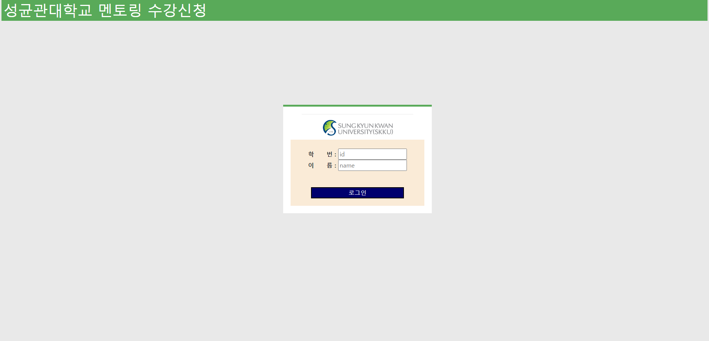

테스트 계정은 다음과 같다. 
학번 : 20203121 + 10~29
이름 : Student + 10~29

AWS RDS에 post request를 보내고, 학생의 학번과 비밀번호를 비교하여 로그인 여부를 수신 받는다. 일치하면 'Success', 틀리면 'Wrong ID password', 그리고 입력하지 않았다면 'Please Enter your ID and Password'를 띄운다.

## 로그인 직후 화면
---

로그인 이후 가능한 시나리오는 다음과 같다.

- 공지사항 : 로그인 직후에 나오는 화면으로, 성균튜터링에 대한 설명과 신청 기간 등을 확인할 수 있다.
- 튜터 : 튜터링 과목 등록
- 튜티 : 튜터링 수강 과목 신청

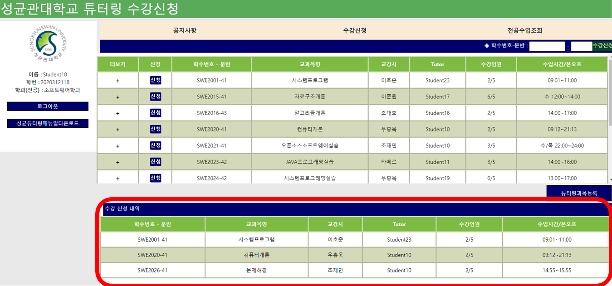

- 튜티 : 튜터링 신청 현황 확인

- 전공수업조회 : 해당학기에 개설된 과목들을 확인하고 각 과목의 튜터링 개설여부를 확인할 수 있다.

- 성균튜터링 메뉴얼 다운로드 : 성균관대학교 홈페이지 공지사항에서 확인 가능한 문서로, 이곳에서도 확인할 수 있도록 업로드해두었다.
- 로그아웃 : 처음 로그인 화면으로 되돌아간다.

## 튜터 : 튜터링 과목 등록
---
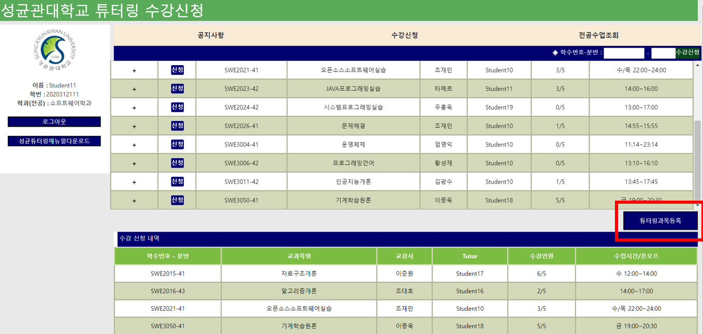

로그인 직후 화면에서 "튜터링 과목 등록" 버튼을 눌러 과목 등록을 아래 절차에 따라 진행한다.

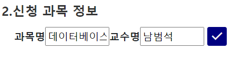

1. 과목명과 교수명을 입력 받고, 체크버튼을 눌러 실제 존재하는 과목인지 확인한다.

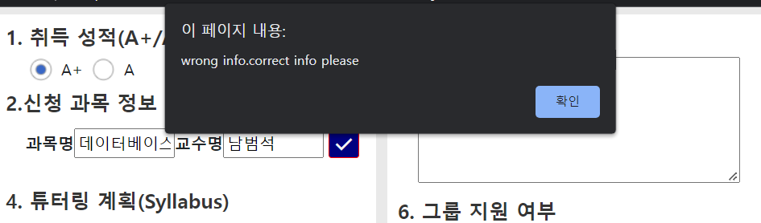

2. 존재하지 않는 과목인 경우, 과목등록을 진행할 수 없다. check 버튼을 눌렀을 때, 위와 같은 알림을 받는다. 실제 존재하는 과목 여부는 전공수업조회란에서 확인할 수 있다.

3. 튜터링 계획과 지원동기는 필수적으로 입력해야한다. 

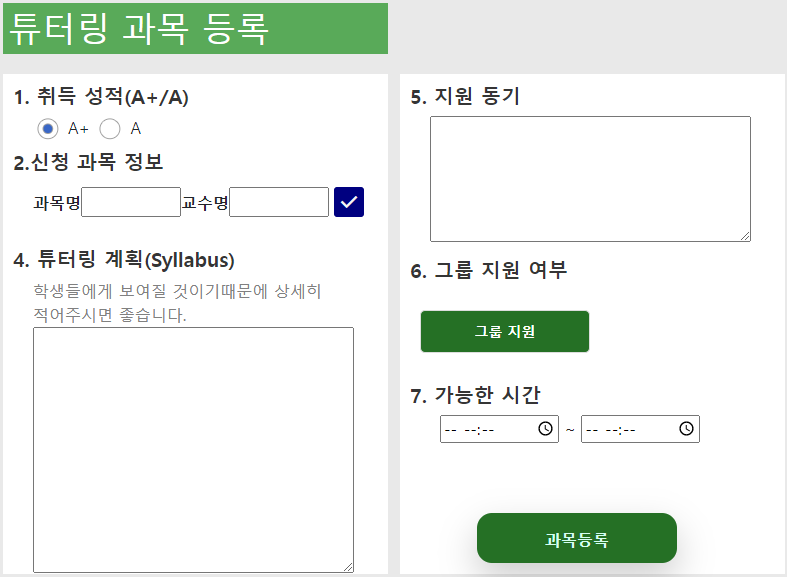

4. 그룹지원 여부를 선택할 수 있다.

5. 그룹지원을 선택하는 경우 멘티들의 '학번'을 입력해야 한다. 이때, 학번은 ','를 기준으로 구분된다.

6. 가능한 시간을 입력하고 과목을 등록한다.

7. 과목이 등록가능한 경우는 다음 조건을 모두 만족해야한다.
    
    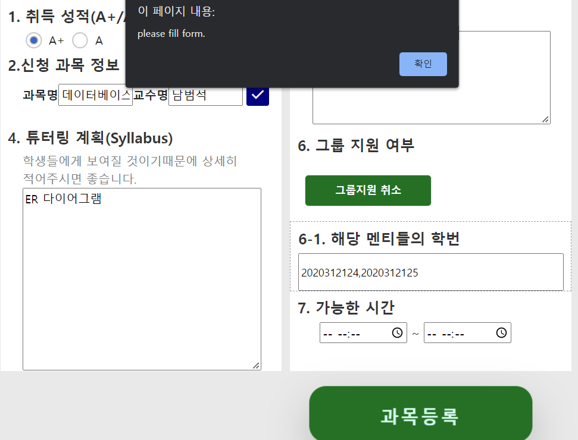

    - 위에서 3.이 만족되어야 함. 그렇지 않으면 "please fill form." 알림을 받게 된다.

    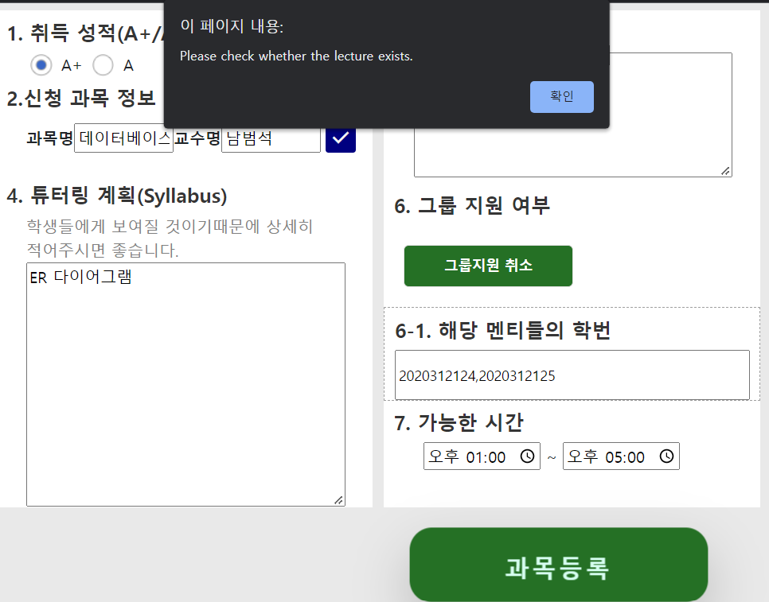

    - 앞서 신청 과목 정보가 존재해야 함. check 버튼이 눌리지 않았거나, 존재하지 않는 과목이면 "Please check whether the lecture exists." 알림을 받는다.

    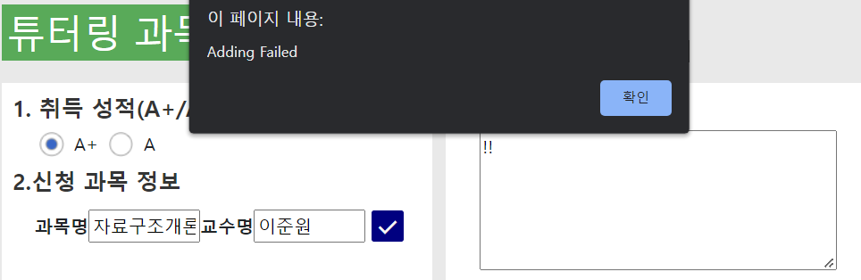

    - 해당 과목의 튜터링이 존재하지 않아야 함.(이는 전공수업조회란에서 '불가'로 표기된 과목들을 말함). 이 경우에는 server에서 False라는 return을 보내며, 이 경우 Adding Failed 알림을 받게된다.
    - 입력한 튜티들이 이미 등록되어 존재하는 학번임.(이때 위에 20개의 테스트 계정을 참고) 마찬가지로, 이 경우 Adding Failed 알림을 받게된다.

8. 이후 과목등록 버튼을 눌러, 위 조건이 모두 충족되면 'Tutoring Course Added' 알림을 받게 된다. 그렇지 않으면 'Adding Failed' 알림을 받는다.
9. 이후 알림이 꺼지고 나면, 창은 자동으로 종료된다. 해당 **튜터링이 잘 등록되었는지 확인하기 위해 새로고침**을 하고 나서, 수강신청란을 확인하면, 과목이 추가된 것을 확인할 수 있다. 

## 튜티 : 튜터링 신청 
---
### 자세한 정보 보기
과목 목록의 더보기 버튼을 눌러 자세한 정보를 확인할 수 있다. 

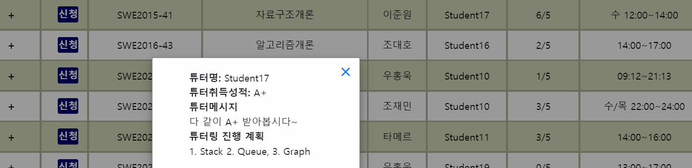

### 방법1 : 신청 버튼
---
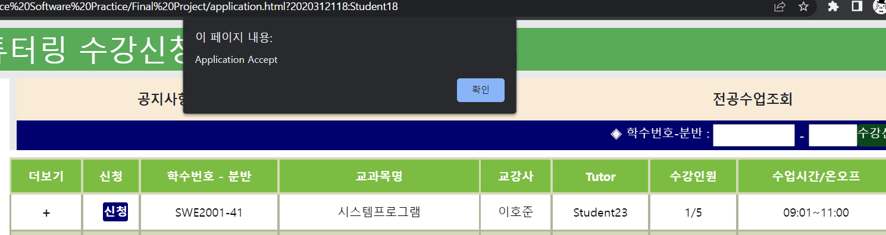

1. 원하는 과목의 신청버튼을 누른다.
2. 확인버튼을 누르면 사이트는 자동으로 새로고침 될 것이다.

3. 수강신청 내역은 아래에서도 확인할 수 있다. 

### 방법2 : 학수번호 분반 입력 후 신청 버튼 누르기
---
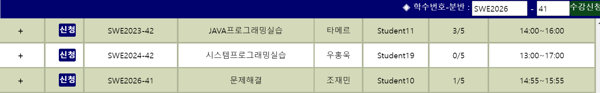
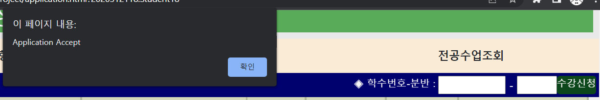

1. 원하는 과목의 학수번호, 분반을 입력하고, 수강신청 버튼을 누른다.
2. 수강신청이 가능한 경우에 위의 그림에서 확인할 수 있듯이, "Application Accept"알림을 확인할 수 있다. 
3. 이외의 에러메세지는 학수번호, 분반을 잘못 입력하는 경우에 발생할 수 있다.

---
우수 프로젝트 시상 프로그램에 지원합니다.
